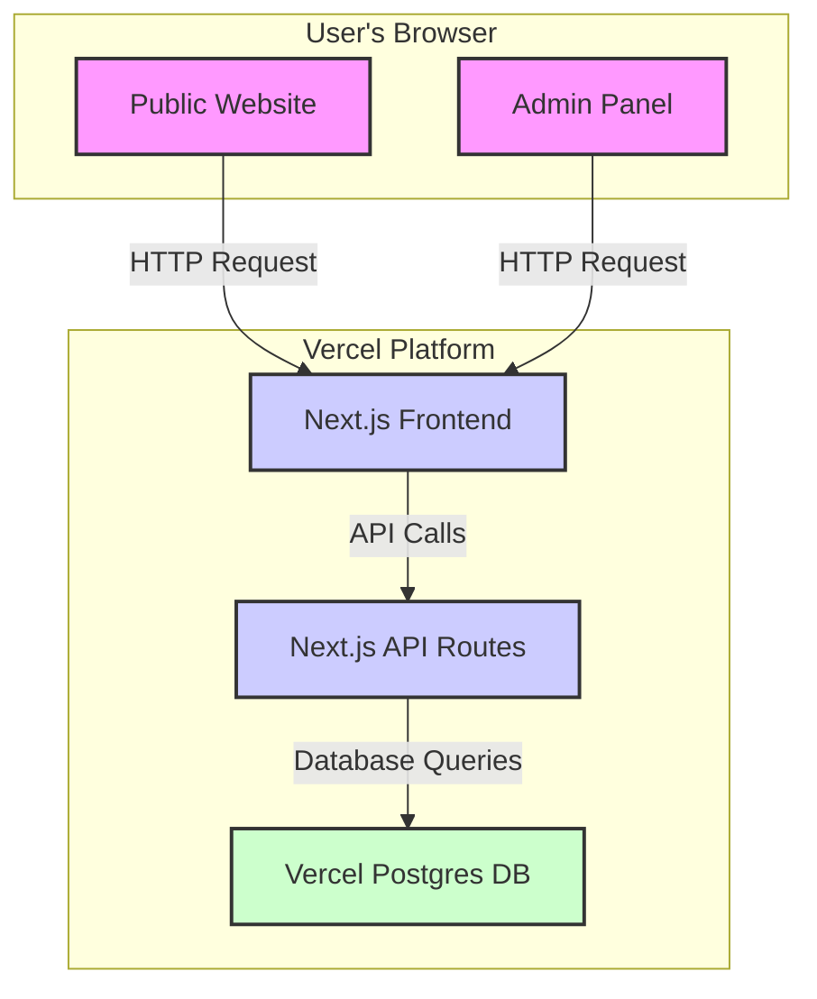

# GEGA & MEGA E-commerce Website: Technical Architecture

This document outlines the technical foundation for the GEGA & MEGA e-commerce website.

### **1. Technology Stack**

*   **Frontend:** **Next.js (React Framework)**
    *   **Justification:** Perfect for modern, performant websites. Its features like Server-Side Rendering (SSR) and Static Site Generation (SSG) will boost SEO and speed. Vercel, our deployment target, is made by the Next.js team, ensuring a smooth and optimized deployment.
*   **Backend:** **Next.js API Routes**
    *   **Justification:** We'll use the built-in API capabilities of Next.js. This keeps our frontend and backend code in one place, simplifying development and deployment. It's a serverless approach, which is cost-effective and scales automatically.
*   **Database:** **Vercel Postgres**
    *   **Justification:** A serverless PostgreSQL database that works seamlessly with Vercel and Next.js. It's easy to set up, scales on demand, and is perfect for the structured data of an e-commerce site.
*   **Styling:** **Tailwind CSS**
    *   **Justification:** A utility-first CSS framework for building modern and professional-looking UIs quickly without writing a lot of custom CSS.
*   **Authentication:** **NextAuth.js**
    *   **Justification:** A complete authentication solution for Next.js to secure the admin panel. It's easy to implement and supports various login methods.

### **2. System Architecture**

The website will be a single Next.js application deployed on Vercel.

*   **Frontend:** The public website and the admin panel will be built with Next.js and React.
*   **Backend (API):** Next.js API Routes will handle all backend logic, like managing products and services, and admin authentication.
*   **Database:** Vercel Postgres will store all data for products, services, and admin users.

Here is a diagram illustrating the architecture:

### **3. Data Models**

Here are the basic database schemas:

**`products` table:**

| Column Name   | Data Type            | Description                           |
| :------------ | :------------------- | :------------------------------------ |
| `id`          | `SERIAL PRIMARY KEY` | Unique identifier for the product     |
| `name`        | `VARCHAR(255)`       | Name of the product                   |
| `description` | `TEXT`               | Detailed description of the product   |
| `price`       | `DECIMAL(10, 2)`     | Price of the product                  |
| `image_url`   | `VARCHAR(255)`       | URL for the product image             |
| `category`    | `VARCHAR(100)`       | e.g., 'Laptops', 'Parts', 'Pre-built' |
| `stock`       | `INTEGER`            | Number of items in stock              |
| `created_at`  | `TIMESTAMP`          | Timestamp of creation                 |
| `updated_at`  | `TIMESTAMP`          | Timestamp of last update              |

**`services` table:**

| Column Name   | Data Type            | Description                         |
| :------------ | :------------------- | :---------------------------------- |
| `id`          | `SERIAL PRIMARY KEY` | Unique identifier for the service   |
| `name`        | `VARCHAR(255)`       | Name of the service                 |
| `description` | `TEXT`               | Detailed description of the service |
| `price`       | `DECIMAL(10, 2)`     | Price of the service                |
| `category`    | `VARCHAR(100)`       | e.g., 'Repair', 'Software'          |
| `created_at`  | `TIMESTAMP`          | Timestamp of creation               |
| `updated_at`  | `TIMESTAMP`          | Timestamp of last update            |

**`users` table (for admin):**

| Column Name  | Data Type             | Description                    |
| :----------- | :-------------------- | :----------------------------- |
| `id`         | `SERIAL PRIMARY KEY`  | Unique identifier for the user |
| `email`      | `VARCHAR(255) UNIQUE` | User's email for login         |
| `password`   | `VARCHAR(255)`        | Hashed password                |
| `created_at` | `TIMESTAMP`           | Timestamp of creation          |